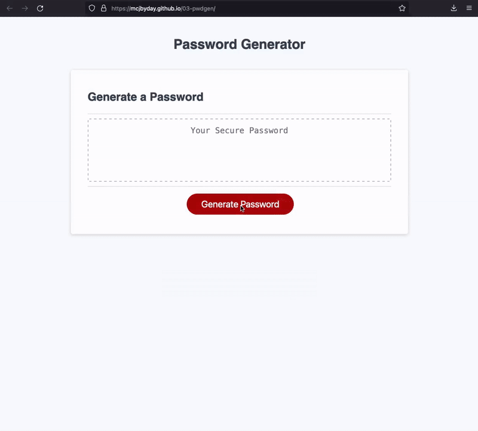

# 03-pwdgen

## Description

This repository contains a web page that will generate a password based on criteria provided by the user. Once generated, the password is displayed in the main container for easy clipboard copy and pasting. 

## Features
- The password can be set to have a user-specified length anywhere between 8 and 128 characters 
- The user has the ability to generate a password that contains or excludes lowercase, uppercase, numeric, or special characters 

## Technologies
- HTML5
- CSS3
- Vanilla JS

## Links
See it live:  [https://mcjbyday.github.io/03-pwdgen/](https://mcjbyday.github.io/03-pwdgen/)

## Screencapture

## Other

No external installations are required to view this website. 

## Contact
Comments or questions?  
Author: Michael Jacobs  
Email: jacobsmichaelc@gmail.com  
GitHub: [https://github.com/mcjbyday](https://github.com/mcjbyday)  